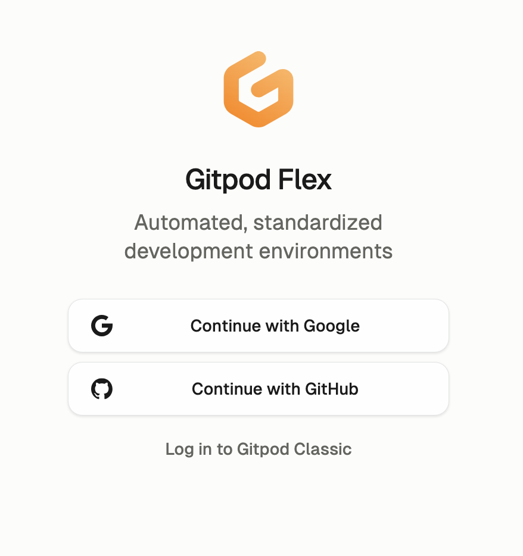
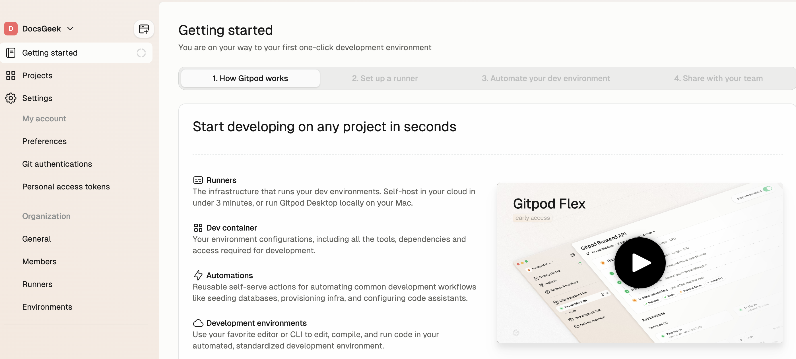
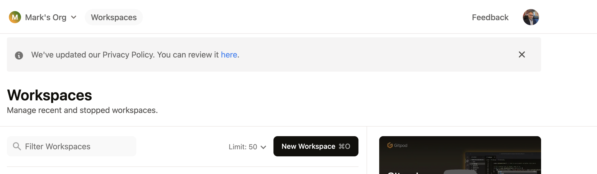

# Opening the Course Repository in a Gitpod Workspace

Using Gitpod provides a convenient alternative to setting up a local development environment.

## Prerequisites

- If you have not already, download the following applications:

  - **Discord**
  - **Postman**
  - **Google Chrome**

- If you haven't already, make sure to [join the Discord server](https://github.com/mawentowski/api-documentation-course-gitpod/blob/main/README.md#join-the-discord-server).

## Creating a Gitpod Workspace

### 1. Sign Up for Gitpod

1. Visit the [Gitpod website](https://www.gitpod.io/) and sign up.
2. Click **Continue with Google** and create an account using your personal email address.

   

3. If prompted, click **Authorize gitpod-io**.

4. When prompted, create a personal organization (this is unrelated to the course). You can skip the questions regarding your role and Gitpod goals.

5. Once the authorization process is complete, you may be directed to the following screen. If so, then close this tab as you will not need it.

   

### 2. Access the Gitpod Workspaces Page

1. Open the [Gitpod Workspaces page](https://gitpod.io/workspaces). If prompted, log in to be redirected to the Workspaces page:

   

2. If you're unable to access the Workspaces page, visit the [Gitpod website](https://www.gitpod.io/). Look for the **Dashboard** button in the top-right corner and click it to load the Workspaces screen. Alternatively, visit [https://gitpod.io/workspaces](https://gitpod.io/workspaces) directly.

### 3. Open the Workspace

1. Open a workspace by clicking this URL: [https://gitpod.io/#https://github.com/mawentowski/api-documentation-course-gitpod](https://gitpod.io/#https://github.com/mawentowski/api-documentation-course-gitpod).

   You should see a screen like this:

   

2. Click **Continue**.
3. Wait for Gitpod to prepare the workspace. This may take a few minutes as it configures everything.

---

## Testing the Setup

After setting up the workspace, follow these steps to verify everything is working:

### 1. Test the Workspace

Follow the steps in the [GitPod User Guide](./gitpod-user-guide.md). Ensure you can complete the steps described. Skip the last section, "IMPORTANT: Stopping the Workspace".

---

## Importing Postman collections

First, copy the server URL the GitPod workspace. To do this, go to the bottom of the screen, click **Ports**, and click the copy button next to the Node.js server port address.

With the server URL copied to your clipboard, proceed to the next step by completing the [Postman setup instructions](./postman-setup-gitpod.md).

---

## Stopping the Workspace

Follow the instructions in the [GitPod User Guide](./gitpod-user-guide.md) > "IMPORTANT: Stopping the Workspace" secetion for stopping the workspace.

You have 50 free hours included with the GitPod Free Plan, which should be enough to cover the duration of the course IF you stop your workspace EVERY time you have completed an exercise.

It's important to stop the workspace when you're done working, whether after an exercise, demonstration, or when you're finished for the day.

---

## Completing the setup

By following the steps outlined in this guide, you will have successfully completed the Gitpod setup and are fully prepared to begin the course exercises.
