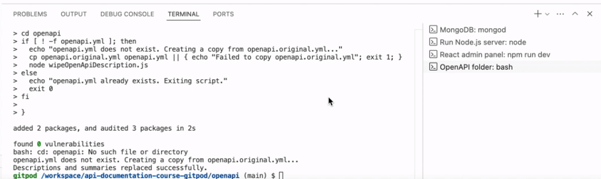
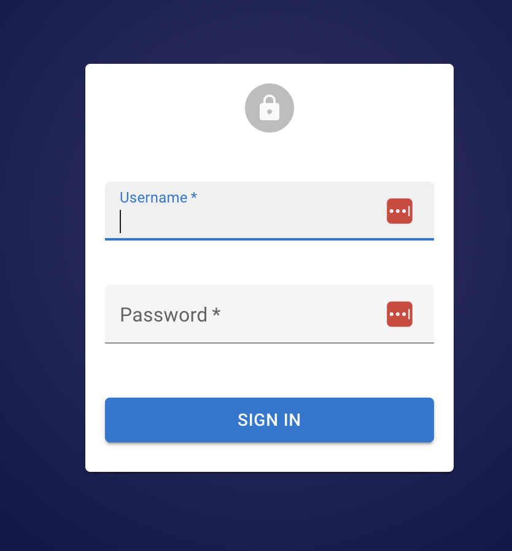
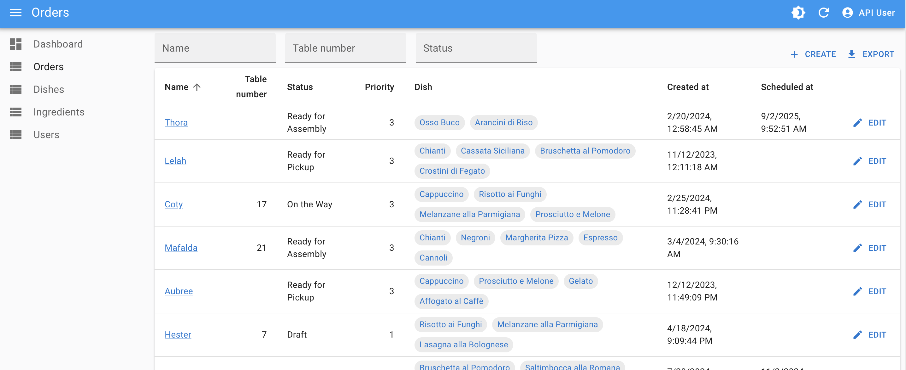
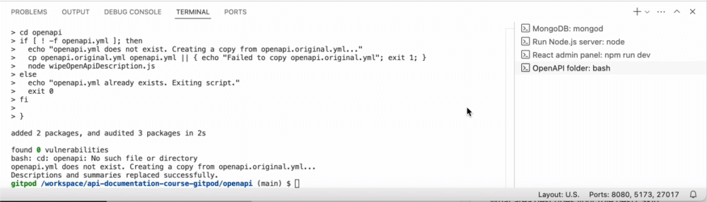
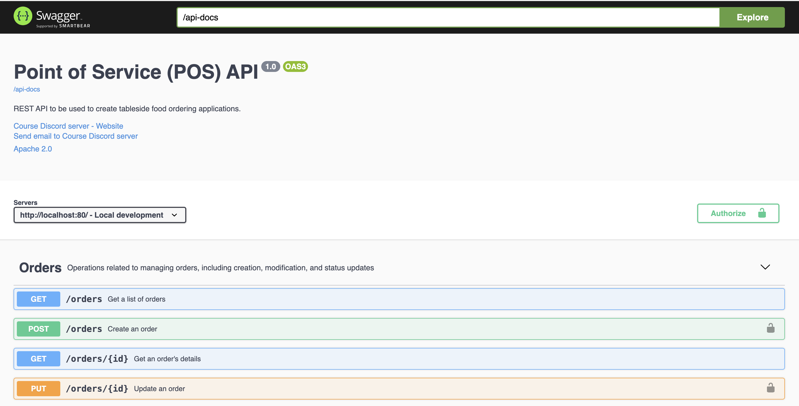
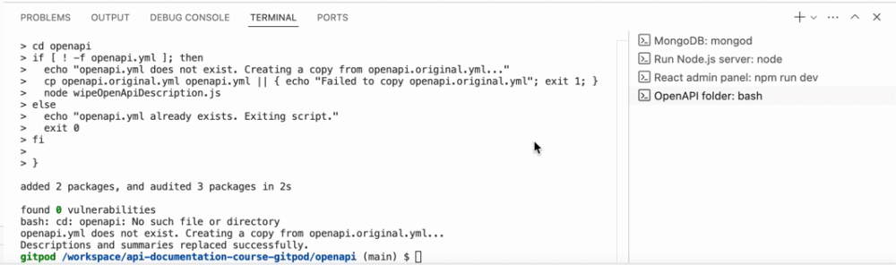
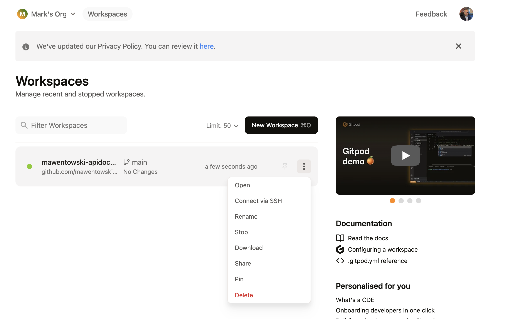

# GitPod User Guide

This guide will walk you through accessing the different apps needed to complete exercises in the course.

## Prerequisites:

- Your GitPod workspace is open and has successfully loaded.

## Open React Admin Panel

To open React Admin Panel in GitPod:

1. At the bottom of the screen, click **Ports**, then select **React Admin Panel** (port 5173) to open it.

   

   - If the link isn’t available, or does not work, the React Admin Panel might still be loading. Wait a minute and try again.
   - Once loaded, the login screen will appear:

   

   (It's normal for a red banner to briefly appear.)

2. Log in using the following credentials:

   - **Username:** devuser02
   - **Password:** SecureP@ss456

3. After logging in, click on **Orders**. A list of orders should appear like this:

   

   If you see the orders displayed, the React Admin Panel is working correctly.

## Open Swagger UI

To open Swagger UI in GitPod:

1. At the bottom of the screen, click **Ports**, then copy the server URL by clicking the copy button next to the Node.js server address.

   

2. Open a new browser tab, paste the copied URL, and add `/docs` to the end. Press enter, and Swagger UI should load like this:

   

## Running Curl Commands

To run Curl commands a GitPod terminal:

1. Open a new terminal in your workspace and name it "Curl" as shown below:

   

2. Run the following command to make a request:

   ```bash
   curl -X GET "https://api.chucknorris.io/jokes/random"
   ```

   The output will look something like this (the joke will vary):

   ```shell
   {"categories":[],"created_at":"2020-01-05 13:42:26.194739","icon_url":"https://api.chucknorris.io/img/avatar/chuck-norris.png","id":"ZYuYuFQVSfamBUYfzFADMQ","updated_at":"2020-01-05 13:42:26.194739","url":"https://api.chucknorris.io/jokes/ZYuYuFQVSfamBUYfzFADMQ","value":"Chuck Norris has more subscribers than Pewdiepie."}%
   ```

## IMPORTANT: Stopping the Workspace

**Note**: If you are still completing the GitPod set up, then disregard this step. Instead, return to where you left off in the [GitPod setup](./gitpod-setup.md).

To stop the workspace:

1. Go to [https://gitpod.io/workspaces](https://gitpod.io/workspaces).
2. Click the three dots (**⋮**) next to your active workspace and select **Stop**.

   

   - If "Stop" isn’t visible, the workspace is already stopped.
   - Ensure all active workspaces are stopped to avoid unnecessary usage.
