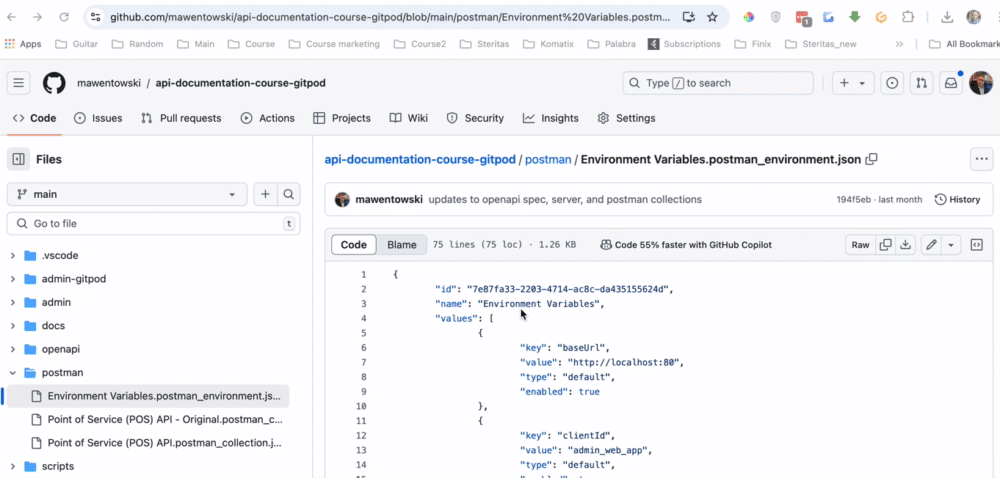
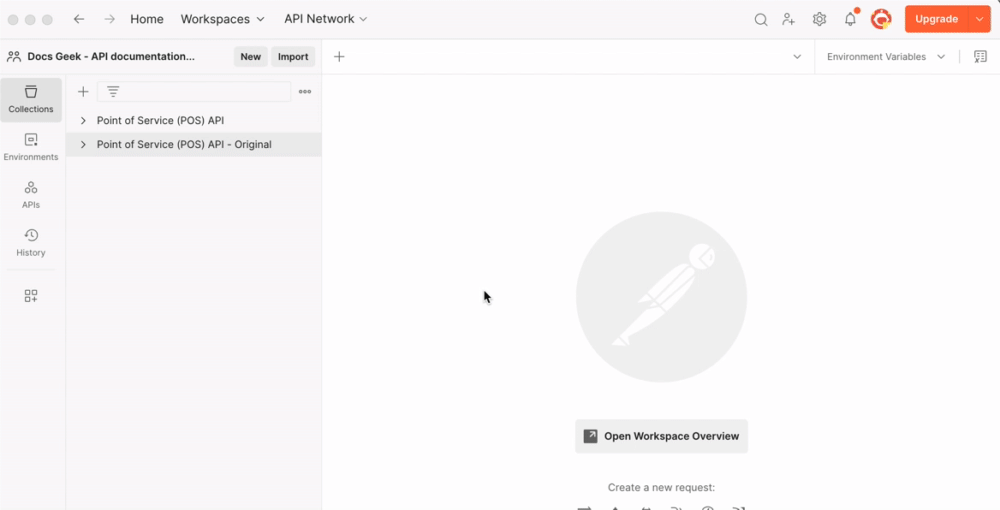
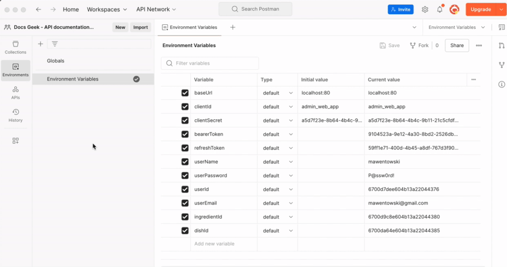

# Import Postman Collections into Postman

To import Postman collections and environment variables, perform the following steps.

**Prerequisites**:

- You copied the server URL per the instructions in the [GitPod Setup](./gitpod-setup.md) > "Importing Postman collections" section.

1. **Download Postman files from GitHub**:

   - Go to [postman/Environment Variables.postman_environment.json](https://github.com/mawentowski/api-documentation-course-gitpod/blob/main/postman/Environment%20Variables.postman_environment.json)

   - Click the "Download raw file" button.

     For example:

     

   - Go to [postman/Point of Service (POS) API - Original.postman_collection.json](<https://github.com/mawentowski/api-documentation-course-gitpod/blob/main/postman/Point%20of%20Service%20(POS)%20API%20-%20Original.postman_collection.json>)

   - Click the "Download raw file" button

   - Go to [postman/Point of Service (POS) API.postman_collection.json](<https://github.com/mawentowski/api-documentation-course-gitpod/blob/main/postman/Point%20of%20Service%20(POS)%20API.postman_collection.json>)

   - Click the "Download raw file" button

     All 3 files are now downloaded to your **Downloads** folder.

2. **Launch Postman:**
   Open the Postman application on your computer. If you don’t have Postman installed, you can download it from the [Postman website](https://www.postman.com/downloads/).

3. **Create a Postman account:**
   If this is your first time using Postman, you’ll be prompted to create an account. You can sign up using an email address or continue with your Google or GitHub account. This account will allow you to save your work and sync it across devices.

   Note for Windows Users: If you encounter a dialog saying "Windows Defender Firewall has blocked some features of this app," it's safe to click "Allow Access" to ensure Postman can function properly. This is a standard security prompt and won't harm your system.

4. **Go to the Import Menu:**
   Click on the **Import** button located in the top-left corner of the Postman app or use the shortcut `Ctrl + O` (Windows/Linux) or `Cmd + O` (Mac).

5. **Import Files:**

   - In the **Import** dialog, you’ll see options to
   - Where it says, **Drop Anywhere to Import**, drag and drop the 3 Postman files downloaded earlier from your **Downloads** folder, or where you downloaded the Postman files previously.
   - Postman should display three files for import. Click **Import** to import all files.

6. **Select the Environment:**

   - In the top-right corner of the Postman app, select **No Environment**.
   - Select **Environment Variables**.
     Here’s a clearer version:

---

### 7. **Set `baseUrl` in Environment Variables**

Follow the steps shown in the video below.

For written instructions:

- Click the **Environments** tab.
- Select **Environment Variables**.
- Paste the server URL you copied earlier into both the **Initial Value** and **Current Value** fields for the `baseUrl` variable.
- Save the file.

### 8. **Test the `baseUrl` Configuration**

Verify the setup by following the steps in the video below.

For written instructions:

- Click the **Collections** tab.
- Expand the **Point of Service (POS) API - Original** collection.
- Expand the **Dishes** folder.
- Open the **Get a List of Dishes** request.
- Click the blue **Send** button.

If the response returns successfully, your Postman configuration is correct.

Return to [GitPod Setup](./gitpod-setup.md) > "Stopping the Workspace".
